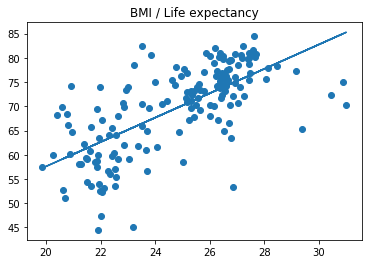

# Linear regression
 
## Target
Use linear regression to make prediction on life expectancy from [body mass index (BMI)](https://en.wikipedia.org/wiki/Body_mass_index) from birth. 

## Data
The data comes from [Gapminder](https://www.gapminder.org/).

## Python model tools
1. scikit-learn's
    - [LinearRegression](http://scikit-learn.org/stable/modules/generated/sklearn.linear_model.LinearRegression.html)
    - [fit()](http://scikit-learn.org/stable/modules/generated/sklearn.linear_model.LinearRegression.html#sklearn.linear_model.LinearRegression.fit)
    - [predict()](http://scikit-learn.org/stable/modules/generated/sklearn.linear_model.LinearRegression.html#sklearn.linear_model.LinearRegression.predict)
    
2. pandas 
3. matplotlib


```python
import pandas as pd
from sklearn.linear_model import LinearRegression
import matplotlib.pyplot as plt

plt.title(u"BMI / Life expectancy")
bmi_dataframe = pd.read_csv("bmi_and_life_expectancy.csv")
bmi_reg = LinearRegression()
x_values = bmi_dataframe[['BMI']]  
y_values = bmi_dataframe[['Life expectancy']]
bmi_reg.fit(x_values,y_values)  # 线性回归拟合模型

plt.scatter(x_values,y_values)
plt.plot(x_values, bmi_reg.predict(x_values))  # 通过拟合模型，通过x axis得到预测数据点
plt.show()

print(bmi_reg.predict(21.07931))  # 预测一个BMI对应的寿命
```





    [[ 60.31564716]]
    
