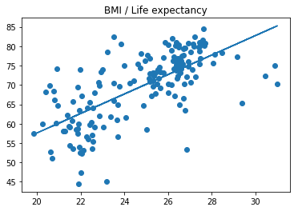

 # Linear regression  && Multiple Linear Regression
 
 ## Target
1. Linear regression：Use linear regression to make prediction on life expectancy from [body mass index (BMI)](https://en.wikipedia.org/wiki/Body_mass_index) from birth.
2. Multiple Linear Regression：Using the Boston house-prices dataset. The dataset consists of 13 features of 506 houses and their median value in $1000's. Need to fit a model on the 13 features to predict on the value of houses.

## 1：Linear regression:Prediction on life expectancy from body mass index (BMI)
## Data
The data comes from [Gapminder](https://www.gapminder.org/).

## Python model tools
1. scikit-learn's
    - [LinearRegression](http://scikit-learn.org/stable/modules/generated/sklearn.linear_model.LinearRegression.html)
    - [fit()](http://scikit-learn.org/stable/modules/generated/sklearn.linear_model.LinearRegression.html#sklearn.linear_model.LinearRegression.fit)
    - [predict()](http://scikit-learn.org/stable/modules/generated/sklearn.linear_model.LinearRegression.html#sklearn.linear_model.LinearRegression.predict)
    
2. pandas 
3. matplotlib
>>> from sklearn.linear_model import LinearRegression
>>> model = LinearRegression()
>>> model.fit(x_values, y_values)

>>> print(model.predict([ [127], [248] ]))
[[ 438.94308857, 127.14839521]]

```python
import pandas as pd
from sklearn.linear_model import LinearRegression
import matplotlib.pyplot as plt

plt.title(u"BMI / Life expectancy")
bmi_dataframe = pd.read_csv("bmi_and_life_expectancy.csv")
bmi_reg = LinearRegression()
x_values = bmi_dataframe[['BMI']]  
y_values = bmi_dataframe[['Life expectancy']]
bmi_reg.fit(x_values,y_values)  # 线性回归拟合模型
print(x_values.shape)
print(y_values.shape)
plt.scatter(x_values,y_values)
plt.plot(x_values, bmi_reg.predict(x_values))  # 通过拟合模型，通过x axis得到预测数据点
plt.show()

print(bmi_reg.predict(21.07931))  # 预测一个BMI对应的寿命
```

    (163, 1)
    (163, 1)
    





    [[ 60.31564716]]
    

## 2:Multiple Linear Regression


```python
from sklearn.linear_model import LinearRegression
from sklearn.datasets import load_boston  # 获取数据集合

boston_data = load_boston()
x = boston_data['data']
y = boston_data['target']
print(x.shape)
print(y.shape)

model = LinearRegression()  # 创建和拟合线性回归模型
model.fit(x, y)  # 训练数据

#  通过数据，进行预测
sample_house = [[2.29690000e-01, 0.00000000e+00, 1.05900000e+01, 0.00000000e+00, 4.89000000e-01,
                6.32600000e+00, 5.25000000e+01, 4.35490000e+00, 4.00000000e+00, 2.77000000e+02,
                1.86000000e+01, 3.94870000e+02, 1.09700000e+01]]
# TODO: 预测结果
prediction = model.predict(sample_house)
print(prediction)
```

    (506, 13)
    (506,)
    [ 23.68420569]
    
